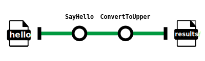
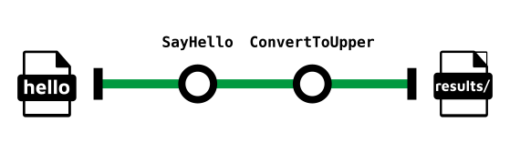

# bytesize_animate_subway_map

Animating subway maps in SVG.

The aim of this bytesize will be to animate a subway map in SVG.
The subway map will be a simple one, with only two stations and one line to illustrate the `Hello Nextflow` training.
Files are already provided:

SVG:

PNG:

